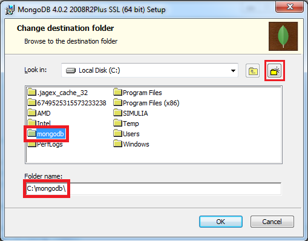
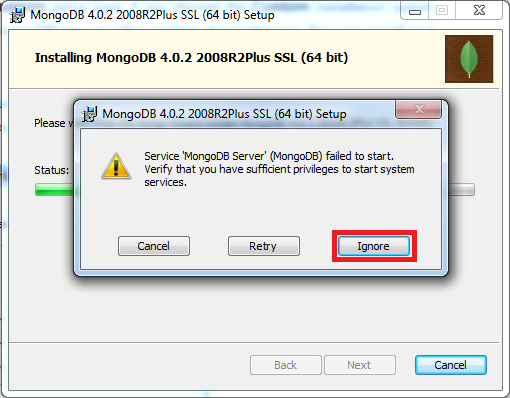

# ORCWall Application

## Technologies
* Node.js
* Nodemon
* Express
* Express Validation
* MongoDB & Mongoose
* Pug Templating
* Passport.js Authentication
* BCrypt Hashing

### Recommended Technologies
* GitBash
* A text editor for code (i.e. Sublime Text 3, Atom)

## Usage

### Installation

#### Install Node.js

To install Node.js on your machine, go to the following [website]https://nodejs.org/en/.
Download and install the LTS (Long Term Support) version.

#### Install MongoDB

1. Download MongoDB Community Edition
  * Open a web browser and visit the [MongoDB Download Center Community Server Tab](https://www.mongodb.com/download-center?jmp=docs#production)
  * Click Download (msi)

2. Open the .msi file

3. Follow the MongoDB Community Edition installation
  * Click *Next*
  * Accept the terms in the license agreement and click *Next*
  * Click on the *Custom* button
  * Click the *Browse...* button and create a new folder called *mongodb* inn the *C:/* directory; select that folder as the installation folder
  
  
  
  
  
  * Make sure that the *Install MongoD as a Service* and *Run service as Network Service user* boxes are checked, and click *Next*
  * Unckeck the *Install MongoDB Compass* box and click *Next*
  * Click *Install*
  * If a window pops up informing you that *Service MongoDB has failed to start*, don't panic, this issue will be solved later. Just click *Ignore*
  
  
  
  
  
  * Click *Finish*
  
4. Create a folder called *db* in the *C:/mongodb/data/* directory

5. Execute, in order, *mongod.exe* and *mongo.exe* in the *C:/mongodb/bin/* directory

6. Open a command prompt in administrator mode and type the following command

```sh
$ net start MongoDB
```

7. If an error saying *The service is not responding to the following function* appears, do the following
  * Change your current directory to *C:/mongodb/bin/* using the following command
  
  ```sh
  $ cd C:/mongodb/bin/
  ```
  
  * Type the following command
  
  ```sh
  $ mongod --remove
  ```
  
  * And then type the following command
  
  ```sh
  $ mongod --logpath c:\mongodb\log\mongo.log --dbpath c:\mongodb\data\db --directoryperdb --install
  ```
  
  * And finally type the following command
  
  ```sh
  $ net start MongoDB
  ```
  
8. Now you can execute the *mongo.exe* file in the *C:/mongodb/bin/* directory

#### How do I use MongoDB?

If you want to learn MongoDB more in depth, check its [documentation](https://docs.mongodb.com/)

##### FOR THE TEST UNIT

You only need to create the databases and its collections. The databases will be local for now.

*Note*: Mind your uppercase and lowercase letters.

When you execute *mongo.exe*, you'll be met by a command prompt:

1. Type the following command to check the databases in your computer

```sh
$ show dbs
```
  
2. Type the following command to check which database you are using right now

```sh
$ db
```

3. Type the following command create and use a new database that will be called *users*

```sh
$ use orcwall
```

4. Type the following command create a new collection called *users*

```sh
$ db.createCollection('users')
```

5. Type the following command to check the collections inside your database

```sh
$ show collections
```

And that's all the MongoDB that you'll need to use.

#### Install the dependencies

To install the modules necessary for this application, open a command prompt on the project's directory (the directory that contains the *server.js* file) and type the following command:

```sh
$ npm install
```
#### Run app

Open a command prompt on the project's directory and type the following command:

```sh
$ nodemon
```

### File Description

|Directory           |Description                   |File(s) extension        |
|--------------------|------------------------------|------------------------:|
|config||.js|
|models||.js|
|public|Static assets like CSS files and Images are loaded from here|.css .png .svg|
|readme|Images that provide visual support to the README.md file|.png|
|routes||.js|
|views|Template files like HTML files and PUG files are rendered from here|.html .pug|
